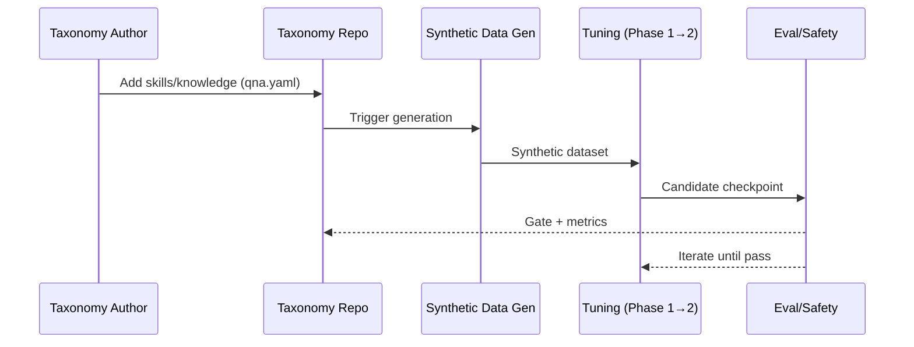
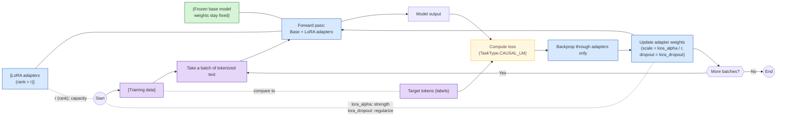
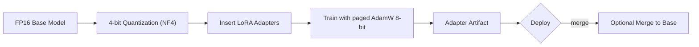
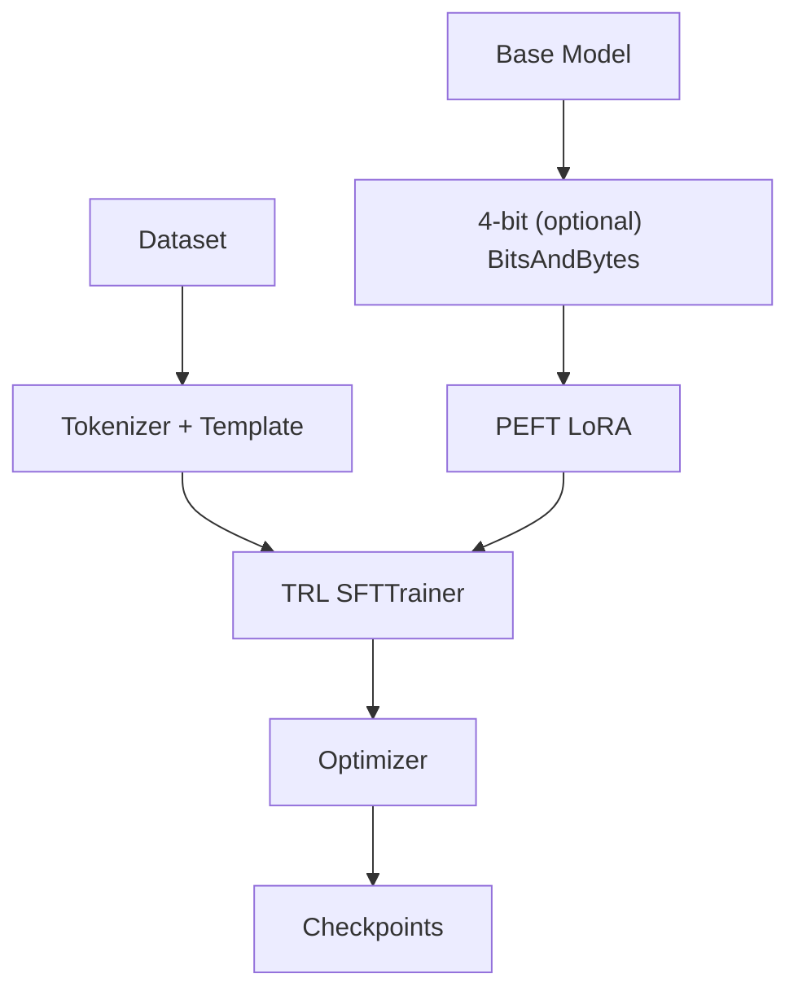
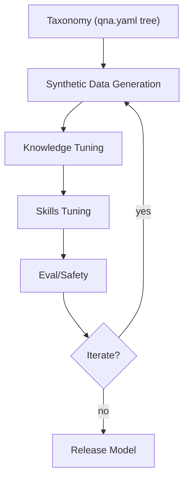

# Background
Back in 2024, my team and I fine-tuned a Lllama model leveraging InstrutLab and Large-scale Alignment for Chatbot (LAB) method: generating synthetic data with a teacher model, and performing Parameter-Efficient-Fine-Tuning (PEFT) to inject IBM Risk Atlas domain expertise into the opensource generative AI model. 

Upon the public archival of the InstructLab project and the subsequent migrations to the individual component projects: [Synthetic Data Generation Hub](https://github.com/Red-Hat-AI-Innovation-Team/sdg_hub) and [Training Hub](https://github.com/Red-Hat-AI-Innovation-Team/training_hub) (an interface for common AI training including Supervised Fine-tuning, Continual Learning, LoRA, ...), I am reflecting on my experience with PEFT and some other thoughts with model tuning. 

### Why are we fine-tuning a model? 
What does it mean to fine tune a model? Fine-tuning models involves adapting pre-trained AI to specific tasks or domains, ranging from full parameter updates to efficient, resource-saving methods. Foundational models have been trained on a large, diverse dataset and are suitable for a wide range of general tasks such as text generation, information retrieval, image generation, codes, and others. 

Fine-tuning a foundational model aims to improve a model's performance on a specific task, within a particular domain, improve its output characteristics, or adapt to new data - all without the full re-training of the model. 

### Fine-Tuning Techniques 

We utilized InstructLab, which uses Large-scale Alignment for ChatBots (LAB method). It generates synthetic data using a teacher model with taxonomy driven approach, and performs multi-phase, parameter-efficient fine tuning [PEFT](https://www.ibm.com/think/topics/parameter-efficient-fine-tuning). I am now curious, what other fine tuning techniques are available and when to use which?

---

# Fine‑Tuning Generative AI: LoRA, QLoRA, PEFT, SFT, and InstructLab’s LAB 

We can adapt a strong base model with **Supervised Fine‑Tuning (SFT)** and **Parameter‑Efficient Fine‑Tuning (PEFT)** methods such as **LoRA** or **QLoRA**. This guide explains each technique, shows Hugging Face implementations, and lists the key parameters and options you’ll actually tweak in practice.

---

### Quick Navigator


| Technique | What it is | When to use | Key knobs you’ll tune |
|---|---|---|---|
| **SFT** | Supervised next‑token training on labeled (prompt → response) data | Baseline instruction tuning, domain/brand voice | max_seq_length |
| **LoRA** | Train **low‑rank adapters** on frozen base weights | Parameter‑efficient tuning with minimal VRAM | `r`, `lora_alpha`, `lora_dropout`, `target_modules` |
| **QLoRA** | LoRA **on a 4‑bit quantized base** (NF4 + double‑quant + paged optimizers) | Lowest VRAM while matching full‑precision SFT quality | `bnb_4bit_*` (NF4/FP4, double‑quant) |
| **PEFT (general)** | Adapter/prompt/prefix‑tuning family incl. LoRA | Compose, swap, ship tiny deltas | Method selection, composition, merge policy |
| **LAB / InstructLab** | Taxonomy‑guided **synthetic alignment** for skills & knowledge | Large‑scale, low‑cost alignment cycles | Taxonomy design, generation filters, two‑phase tuning |

# 1. LAB (Large‑Scale Alignment for ChatBots) - InstructLab
LAB is a taxonomy‑guided synthetic alignment method enabling scalable instruction‑following improvements without large human/GPT‑4 datasets. LAB is implemented in InstructLab, an open‑source project from IBM/Red Hat. 
How LAB Works
1. Taxonomy Authoring
   - Skills & knowledge organized into a directory tree; each leaf contains a qna.yaml. 


2. Synthetic Data Generation
    - Uses taxonomy seeds to generate large, diverse examples with grounding/safety filtering.


3. Two‑Phase Tuning

    - Phase 1: Knowledge
    - Phase 2: Skills


[This is what our team has explored](https://github.com/Henry-Xiao-HX/Parameter-Efficient-Fine-Tuning-with-InstructLab)


InstructLab utilizes PEFT. So what is PEFT?
---

# 2. PEFT
Parameter-Efficient Fine-Tuning (PEFT) is a technique that adapts large, pre-trained models to new tasks by updating only a small subset of parameters rather than the entire model. By freezing most original weights and training only added, lightweight adapters or specific layers, it drastically reduces computational costs, memory, and storage requirements while achieving performance comparable to full fine-tuning. PEFT includes LoRA, QLorA, Prefix Tuning, Prompt Tuning, reducing computational costs and memory requirements.

We will discuss LoRA, QLoRA next. also Supervised Fine-Tuning, think about it as the full parameter update of a model. 

# 3. LoRA - Low‑Rank Adaptation

### What LoRA Is (and Why It Works)

#### The Short Version
LoRA freezes the original weight matrix \(W\) and injects a low‑rank update \(\Delta W = BA\) into selected linear layers; only the small matrices \(A\) and \(B\) are trained. This yields large memory and compute savings with no inference latency once merged.

<details>
<summary><b>The Long Version</b></summary>
<cite>https://www.ibm.com/docs/en/watsonx/w-and-w/2.2.0?topic=tuning-lora-fine</cite>
<br><br>
<i>
  Low-rank adaptation (LoRA) is a parameter-efficient fine-tuning (PEFT) technique that adds a subset of parameters to the frozen base foundation model and updates the subset during the tuning experiment, without modifying the parameters of the base model. When the tuned foundation model is inferenced, the new parameter weights from the subset are added to the parameter weights from the base model to generate output that is customized for a task.
<br><br>
  How the subset of parameters is created involves some mathematics. Remember, the neural network of a foundation model is composed of layers, each with a complex matrix of parameters. These parameters have weight values that are set when the foundation model is initially trained. The subset of parameters that are used for LoRA tuning is derived by applying rank decomposition to the weights of the base foundation model. The rank of a matrix indicates the number of vectors in the matrix that are linearly independent from one another. Rank decomposition, also known as matrix decomposition, is a mathematical method that uses this rank information to represent the original matrix in two smaller matrices that, when multiplied, form a matrix that is the same size as the original matrix. With this method, the two smaller matrices together capture key patterns and relationships from the larger matrix, but with fewer parameters. The smaller matrices produced are called low-rank matrices or low-rank adapters.
<br><br>
  During a LoRA tuning experiment, the weight values of the parameters in the subset–the low-rank adapters–are adjusted. Because the adapters have fewer parameters, the tuning experiment is faster and needs fewer resources to store and compute changes. Although the adapter matrices lack some of the information from the base model matrices, the LoRA tuning method is effective because LoRA exploits the fact that large foundation models typically use many more parameters than are necessary for a task.
<br><br>
  The output of a LoRA fine-tuning experiment is a set of adapters that contain new weights. When these tuned adapters are multiplied, they form a matrix that is the same size as the matrix of the base model. At inference time, the new weights from the product of the adapters are added directly to the base model weights to generate the fine-tuned output.
</i>
</details>

--- 

### Core Parameters & Options (Hugging Face PEFT)
- `r`: controls the size of the low-rand decomposition, LoRA replaces the full weight matrix update with two much smaller matrices of rank r. (e.g., 4 - 64).  
    - Higher r = more expressive adapter = better modeling capacity
    - Lower r = lighter, cheaper to train = underfit complex tasks 
    - Typically 16 - 32 (LoRA), 64 (QLoRA)
- `lora_alpha`: scaling factor, scales the LoRA update before it's added back to the frozen original weight
    - Too small - weak updates, slow learning
    - Too large - unstable training or overshooting 
    - usually lora_alpha = 2 x r 
- `lora_dropout`: (0–0.1 typical).  
    - A regularization technique that randomly ignores a subset of neurons to prevent overfitting and improve generalization on small datasets. Increasing model sparsity and prevents the model from becoming to reliant on specific, small-weight connections
    - A setting of 0.1 means that each neuron has a 10% chance of being ignored during training 
- `target_modules`: "q_proj", "k_proj", "v_proj", "o_proj".  
    - Defines where LoRA layers are injected inside the transformer 
    - "q_proj" - Query projection
    - "k_proj" - Key projection
    - "v_proj" - Value projection
    - "o_proj" - Output projection
    - Usally target the attention layer, `[q_proj, v_proj]` for fast/low-memory training 
- `bias`: typically "none".  
- `task_type`: typically `TaskType.CAUSAL_LM`.  
    - "SEQ_CLS": PeftModelForSequenceClassification,
    - "SEQ_2_SEQ_LM": PeftModelForSeq2SeqLM,
    - "CAUSAL_LM": PeftModelForCausalLM,
    - "TOKEN_CLS": PeftModelForTokenClassification,
    - "QUESTION_ANS": PeftModelForQuestionAnswering,
    - "FEATURE_EXTRACTION": PeftModelForFeatureExtraction,
- `init_lora_weights`: "gaussian" for LoRA, 'False', or "loftq" for QLoRA.  
- **rsLoRA**: stabilizes scaling for higher ranks.

### Minimal LoRA Example (PEFT)
```python
from transformers import AutoModelForCausalLM, AutoTokenizer
from peft import LoraConfig, TaskType, get_peft_model

model_id = "meta-llama/Llama-2-7b-hf"
tok = AutoTokenizer.from_pretrained(model_id, use_fast=True)
model = AutoModelForCausalLM.from_pretrained(model_id, torch_dtype="auto")

lora_cfg = LoraConfig(
    r=16,
    lora_alpha=32,
    lora_dropout=0.05,
    target_modules=["q_proj","k_proj","v_proj","o_proj"],
    task_type=TaskType.CAUSAL_LM,
    init_lora_weights="gaussian",
    bias="none"
)
model = get_peft_model(model, lora_cfg)
model.print_trainable_parameters()

```


# 4. QLoRA - LoRA on 4‑Bit Quantized Bases
### What QLoRA Adds
QLoRA keeps the base model frozen in 4‑bit precision (NF4/FP4) and trains LoRA adapters through quantized weights-achieving 16‑bit SFT parity while enabling 65B‑parameter fine‑tuning on a single 48 GB GPU. It introduces:

- NF4: 4‑bit codebook optimized for normally distributed weights.
- Double quantization: compress scaling constants.
- Paged optimizers: page optimizer states between CPU/GPU to avoid VRAM spikes.

Hugging Face exposes 4‑bit loading via bitsandbytes; see platform support notes. 
### Key Parameters
- BitsAndBytesConfig

  - `load_in_4bit = True`
    - Loads the model’s weights in 4-bit quantized format using the bitsandbytes backend
  - `bnb_4bit_quant_type = "nf4"`
    - "nf4" = NormalFloat4, a data-aware 4 bit quantization designed for activation/weights that roughly follow a normal distribution. It consistently outperforms uniform 4-bit quantization in downstream LLm because it uses non-uniform bins tailored to the statistical distribution of weights 
  - `bnb_4bit_use_double_quant = True`
    - Applies double quantization, and further reduces memory footprint
  - `bnb_4bit_compute_dtype = torch.bfloat16 `

```python
import torch
from transformers import AutoModelForCausalLM, AutoTokenizer, BitsAndBytesConfig
from peft import LoraConfig, get_peft_model, TaskType

bnb_cfg = BitsAndBytesConfig(
    load_in_4bit=True,
    bnb_4bit_quant_type="nf4",
    bnb_4bit_use_double_quant=True,
    bnb_4bit_compute_dtype=torch.bfloat16
)

base = "meta-llama/Llama-2-7b-hf"
tok = AutoTokenizer.from_pretrained(base, use_fast=True)
model = AutoModelForCausalLM.from_pretrained(base, quantization_config=bnb_cfg, device_map="auto")

lora_cfg = LoraConfig(
    r=16, lora_alpha=32, lora_dropout=0.05,
    target_modules=["q_proj","k_proj","v_proj","o_proj"],
    task_type=TaskType.CAUSAL_LM, bias="none"
)
model = get_peft_model(model, lora_cfg)

```



# 5. SFT - Supervised Fine Tuning
In contrast to PEFT, SFT updates all parameters in a pre-trained model for maximum accuracy but is computationally expensive. SFT trains on (prompt → response) labeled data, typically using cross‑entropy. TRL’s SFTTrainer supports LM, prompt‑completion, and conversational/chat datasets with auto chat‑template injection.

Data Options
```json
{"text": "..."}
{"prompt": "...", "completion": "..."}
{"messages":[{"role":"user","content":...}, {"role":"assistant","content":...}]}
```

```python
from trl import SFTTrainer, SFTConfig
from datasets import load_dataset
from transformers import AutoModelForCausalLM, AutoTokenizer

model_id = "Qwen/Qwen3-0.6B"
tok = AutoTokenizer.from_pretrained(model_id, use_fast=True)
model = AutoModelForCausalLM.from_pretrained(model_id)

cfg = SFTConfig(output_dir="./sft-out", dataset_text_field="text", max_seq_length=1024, packing=True)
ds = load_dataset("trl-lib/Capybara", split="train")
trainer = SFTTrainer(model=model, args=cfg, train_dataset=ds)
trainer.train()
```

# Hugging Face Coding Patterns
A. SFT (Full- Precision)
```python
from trl import SFTTrainer, SFTConfig
cfg = SFTConfig(output_dir="./out", max_seq_length=2048, per_device_train_batch_size=2)
trainer = SFTTrainer("facebook/opt-350m", train_dataset=..., args=cfg)
trainer.train()
```
B. LoRA (PEFT)
```python
from peft import LoraConfig, get_peft_model, TaskType
lora = LoraConfig(r=8, lora_alpha=16, lora_dropout=0.05,
                  task_type=TaskType.CAUSAL_LM,
                  target_modules=["q_proj","v_proj"])
model = get_peft_model(model, lora)
```
C. QLora
```python
from transformers import BitsAndBytesConfig

bnb = BitsAndBytesConfig(
    load_in_4bit=True,
    bnb_4bit_quant_type="nf4",
    bnb_4bit_use_double_quant=True,
    bnb_4bit_compute_dtype=torch.bfloat16
)

model = AutoModelForCausalLM.from_pretrained(base, quantization_config=bnb, device_map="auto")
```

# High-Level Architecture
LoRA/QLoRA


LAB

