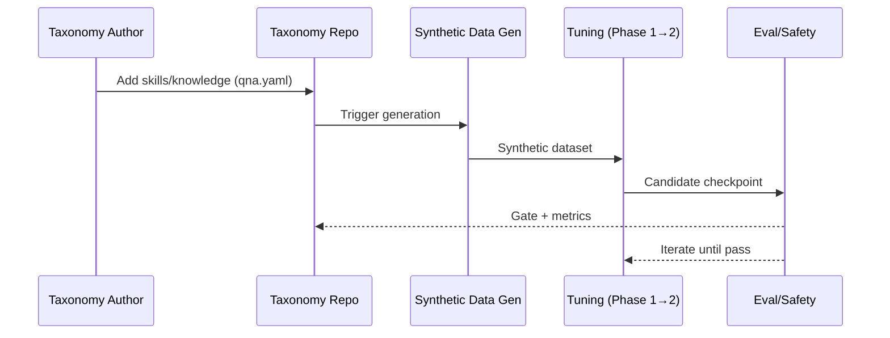
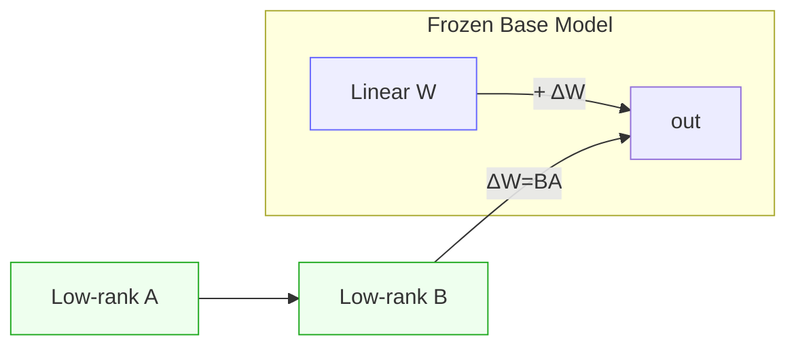
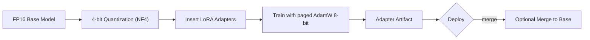
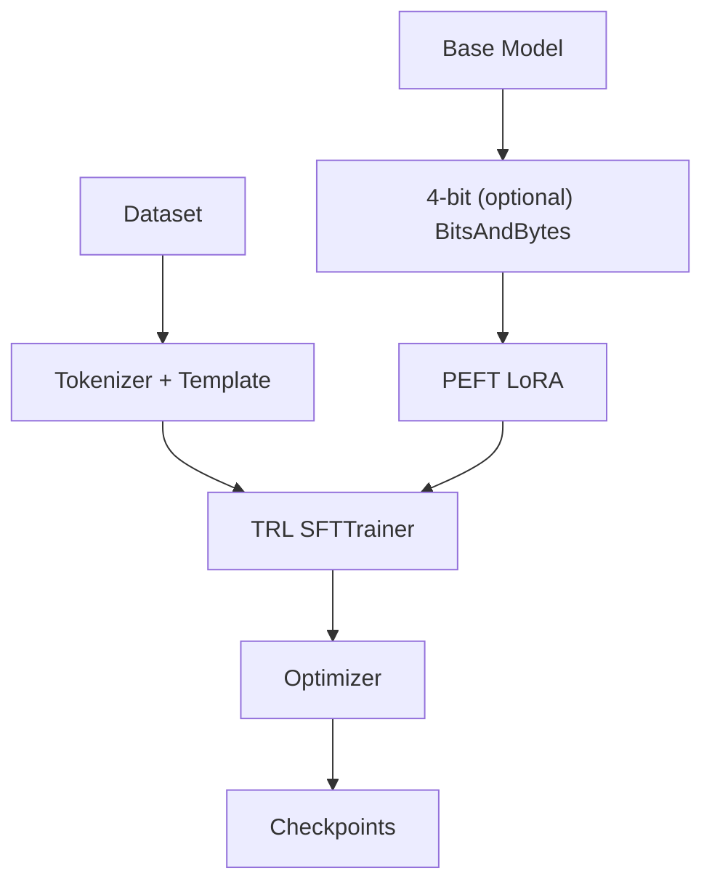
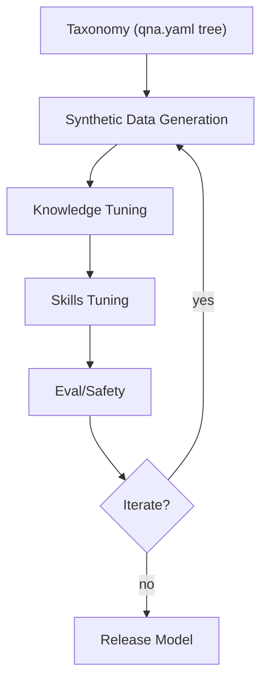

# Background
Back in 2024, my team and I fine-tuned a Lllama model leveraging InstrutLab and Large-scale Alignment for Chatbot (LAB) method: generating synthetic data with a teacher model, and performing Parameter-Efficient-Fine-Tuning (PEFT) to inject IBM Risk Atlas domain expertise into the opensource generative AI model. 

Upon the public archival of the InstructLab project and the subsequent migrations to the individual component projects: [Synthetic Data Generation Hub](https://github.com/Red-Hat-AI-Innovation-Team/sdg_hub) and [Training Hub](https://github.com/Red-Hat-AI-Innovation-Team/training_hub) (an interface for common AI training including Supervised Fine-tuning, Continual Learning, LoRA, ...), I am reflecting on my experience with PEFT and some other thoughts with model tuning. 

### Why are we fine-tuning a model? 
What does it mean to fine tune a model? Fine-tuning models involves adapting pre-trained AI to specific tasks or domains, ranging from full parameter updates to efficient, resource-saving methods. Foundational models have been trained on a large, diverse dataset and are suitable for a wide range of general tasks such as text generation, information retrieval, image generation, codes, and others. 

Fine-tuning a foundational model aims to improve a model's performance on a specific task, within a particular domain, improve its output characteristics, or adapt to new data - all without the full re-training of the model. 

### Fine-Tuning Techniques 

We utilized InstructLab, which uses Large-scale Alignment for ChatBots (LAB method). It generates synthetic data using a teacher model with taxonomy driven approach, and performs multi-phase, parameter-efficient fine tuning [PEFT](https://www.ibm.com/think/topics/parameter-efficient-fine-tuning). I am now curious, what other fine tuning techniques are available and when to use which?

---

# Fine‑Tuning Generative AI: LoRA, QLoRA, PEFT, SFT, and InstructLab’s LAB 

We can adapt a strong base model with **Supervised Fine‑Tuning (SFT)** and **Parameter‑Efficient Fine‑Tuning (PEFT)** methods such as **LoRA** or **QLoRA**. This guide explains each technique, shows Hugging Face implementations, and lists the key parameters and options you’ll actually tweak in practice.

---

### Quick Navigator


| Technique | What it is | When to use | Key knobs you’ll tune |
|---|---|---|---|
| **SFT** | Supervised next‑token training on labeled (prompt → response) data | Baseline instruction tuning, domain/brand voice | `max_seq_length`, packing, optimizer, LR schedule, data formatting |
| **LoRA** | Train **low‑rank adapters** on frozen base weights | Parameter‑efficient tuning with minimal VRAM | `r`, `lora_alpha`, `lora_dropout`, `target_modules`, init (e.g., rsLoRA, LoftQ) |
| **QLoRA** | LoRA **on a 4‑bit quantized base** (NF4 + double‑quant + paged optimizers) | Lowest VRAM while matching full‑precision SFT quality | `bnb_4bit_*` (NF4/FP4, double‑quant), `optim="paged_adamw_8bit"`, LoRA knobs |
| **PEFT (general)** | Adapter/prompt/prefix‑tuning family incl. LoRA | Compose, swap, ship tiny deltas | Method selection, composition, merge policy |
| **LAB / InstructLab** | Taxonomy‑guided **synthetic alignment** for skills & knowledge | Large‑scale, low‑cost alignment cycles | Taxonomy design, generation filters, two‑phase tuning |

# 1. LAB (Large‑Scale Alignment for ChatBots) - InstructLab
LAB is a taxonomy‑guided synthetic alignment method enabling scalable instruction‑following improvements without large human/GPT‑4 datasets. LAB is implemented in InstructLab, an open‑source project from IBM/Red Hat. 
How LAB Works
1. Taxonomy Authoring
   - Skills & knowledge organized into a directory tree; each leaf contains a qna.yaml. 


2. Synthetic Data Generation
    - Uses taxonomy seeds to generate large, diverse examples with grounding/safety filtering.


3. Two‑Phase Tuning

    - Phase 1: Knowledge
    - Phase 2: Skills


[This is what our team has explored](https://github.com/Henry-Xiao-HX/Parameter-Efficient-Fine-Tuning-with-InstructLab)


InstructLab utilizes PEFT. So what is PEFT?
---

# 2. PEFT
Parameter-Efficient Fine-Tuning (PEFT) is a technique that adapts large, pre-trained models to new tasks by updating only a small subset of parameters rather than the entire model. By freezing most original weights and training only added, lightweight adapters or specific layers, it drastically reduces computational costs, memory, and storage requirements while achieving performance comparable to full fine-tuning. PEFT includes LoRA, Adapters, Prefix Tuning, Prompt Tuning, IA³, and more - letting you train tiny parameter sets, compose multiple adapters, or ship compact artifacts. Hugging Face’s peft library implements 30+ methods and initializations (LoftQ, PiSSA, EVA, Arrow, etc.). PEFT surveys provide deeper coverage of algorithmic and system‑level considerations.

```python
from transformers import AutoModelForCausalLM
from peft import get_peft_model, LoraConfig

model = AutoModelForCausalLM.from_pretrained("mistralai/Mistral-7B-v0.1")
peft_cfg = LoraConfig(r=8, lora_alpha=16, target_modules=["q_proj","v_proj"])
model = get_peft_model(model, peft_cfg)
```
# 3. LoRA - Low‑Rank Adaptation

### What LoRA Is (and Why It Works)
**LoRA** freezes the original weight matrix \(W\) and **injects a low‑rank update** \(\Delta W = BA\) into selected linear layers; only the small matrices \(A\) and \(B\) are trained. This yields large memory and compute savings with **no inference latency** once merged.

### Core Parameters & Options (Hugging Face PEFT)
- `r`: adapter rank (e.g., 4–64).  
- `lora_alpha`: scaling factor.  
- `lora_dropout`: (0–0.1 typical).  
- `target_modules`: e.g., `"q_proj", "k_proj", "v_proj", "o_proj"`.  
- `bias`: typically `"none"`.  
- `task_type`: e.g., `TaskType.CAUSAL_LM`.  
- `init_lora_weights`: `"gaussian"`, `False`, or `"loftq"` (quantization‑aware init).  
- **rsLoRA**: stabilizes scaling for higher ranks.

## Minimal LoRA Example (PEFT)
```python
from transformers import AutoModelForCausalLM, AutoTokenizer
from peft import LoraConfig, TaskType, get_peft_model

model_id = "meta-llama/Llama-2-7b-hf"
tok = AutoTokenizer.from_pretrained(model_id, use_fast=True)
model = AutoModelForCausalLM.from_pretrained(model_id, torch_dtype="auto")

lora_cfg = LoraConfig(
    r=16,
    lora_alpha=32,
    lora_dropout=0.05,
    target_modules=["q_proj","k_proj","v_proj","o_proj"],
    task_type=TaskType.CAUSAL_LM,
    init_lora_weights="gaussian",
    bias="none"
)
model = get_peft_model(model, lora_cfg)
model.print_trainable_parameters()

```


# 4. QLoRA - LoRA on 4‑Bit Quantized Bases
### What QLoRA Adds
QLoRA keeps the base model frozen in 4‑bit precision (NF4/FP4) and trains LoRA adapters through quantized weights-achieving 16‑bit SFT parity while enabling 65B‑parameter fine‑tuning on a single 48 GB GPU. It introduces:

- NF4: 4‑bit codebook optimized for normally distributed weights.
- Double quantization: compress scaling constants.
- Paged optimizers: page optimizer states between CPU/GPU to avoid VRAM spikes.

Hugging Face exposes 4‑bit loading via bitsandbytes; see platform support notes. 
### Key Parameters
- BitsAndBytesConfig

  - load_in_4bit=True
  - bnb_4bit_quant_type="nf4"
  - bnb_4bit_use_double_quant=True
  - bnb_4bit_compute_dtype=torch.bfloat16 

- Optimizer
  - optim="paged_adamw_8bit" (reduces VRAM). 

```python
import torch
from transformers import AutoModelForCausalLM, AutoTokenizer, BitsAndBytesConfig
from peft import LoraConfig, get_peft_model, TaskType

bnb_cfg = BitsAndBytesConfig(
    load_in_4bit=True,
    bnb_4bit_quant_type="nf4",
    bnb_4bit_use_double_quant=True,
    bnb_4bit_compute_dtype=torch.bfloat16
)

base = "meta-llama/Llama-2-7b-hf"
tok = AutoTokenizer.from_pretrained(base, use_fast=True)
model = AutoModelForCausalLM.from_pretrained(base, quantization_config=bnb_cfg, device_map="auto")

lora_cfg = LoraConfig(
    r=16, lora_alpha=32, lora_dropout=0.05,
    target_modules=["q_proj","k_proj","v_proj","o_proj"],
    task_type=TaskType.CAUSAL_LM, bias="none"
)
model = get_peft_model(model, lora_cfg)

```



# 5. SFT - Supervised Fine Tuning
In contrast to PEFT, SFT updates all parameters in a pre-trained model for maximum accuracy but is computationally expensive. SFT trains on (prompt → response) labeled data, typically using cross‑entropy. TRL’s SFTTrainer supports LM, prompt‑completion, and conversational/chat datasets with auto chat‑template injection.

Data Options
```json
{"text": "..."}
{"prompt": "...", "completion": "..."}
{"messages":[{"role":"user","content":...}, {"role":"assistant","content":...}]}
```

```python
from trl import SFTTrainer, SFTConfig
from datasets import load_dataset
from transformers import AutoModelForCausalLM, AutoTokenizer

model_id = "Qwen/Qwen3-0.6B"
tok = AutoTokenizer.from_pretrained(model_id, use_fast=True)
model = AutoModelForCausalLM.from_pretrained(model_id)

cfg = SFTConfig(output_dir="./sft-out", dataset_text_field="text", max_seq_length=1024, packing=True)
ds = load_dataset("trl-lib/Capybara", split="train")
trainer = SFTTrainer(model=model, args=cfg, train_dataset=ds)
trainer.train()
```

# Hugging Face Coding Patterns
A. SFT (Full- Precision)
```python
from trl import SFTTrainer, SFTConfig
cfg = SFTConfig(output_dir="./out", max_seq_length=2048, per_device_train_batch_size=2)
trainer = SFTTrainer("facebook/opt-350m", train_dataset=..., args=cfg)
trainer.train()
```
B. LoRA (PEFT)
```python
from peft import LoraConfig, get_peft_model, TaskType
lora = LoraConfig(r=8, lora_alpha=16, lora_dropout=0.05,
                  task_type=TaskType.CAUSAL_LM,
                  target_modules=["q_proj","v_proj"])
model = get_peft_model(model, lora)
```
C. QLora
```python
from transformers import BitsAndBytesConfig

bnb = BitsAndBytesConfig(
    load_in_4bit=True,
    bnb_4bit_quant_type="nf4",
    bnb_4bit_use_double_quant=True,
    bnb_4bit_compute_dtype=torch.bfloat16
)

model = AutoModelForCausalLM.from_pretrained(base, quantization_config=bnb, device_map="auto")
```

# High-Level Architecture
LoRA/QLoRA


LAB

